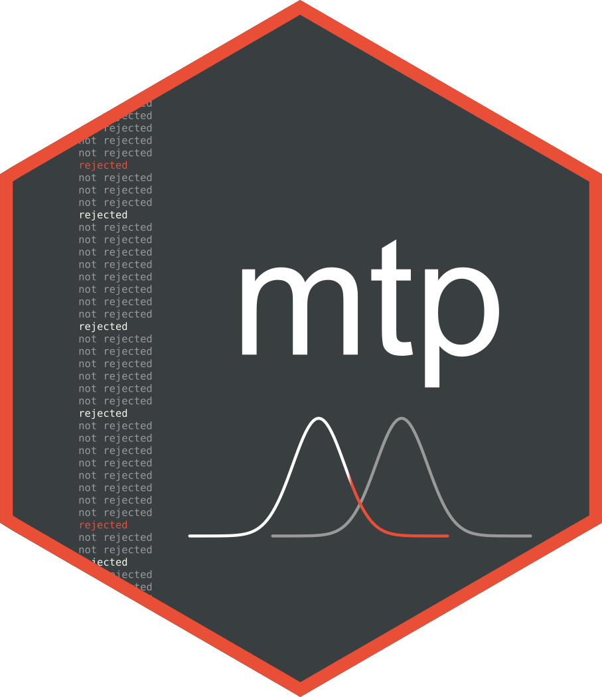

<!-- header = image + name -->
<h1 align="center">
  
  <br><br>
  mtp
  <br>
</h1>

<!-- headline -->
<h4 align="center">Multiple hypothesis testing procedures.</h4>

<!-- badges: start -->
<p align="center">
  
</p>
<!-- badges: end -->

## Description

Control Type I errors (false positives) when
conducting multiple hypothesis tests using
a variety of error criteria and adjustment methods.

## Features

- multiple error criteria:
  - the generalized family-wise error rate (FWER),
  - the false rejection exceedance (FRX),
  - the false rejection rate (FRR),
  - the per-family error rate (PFER).

- adjustment methods for each criterion:
  - single-step methods (e.g., Bonferroni)
  - step-down methods (e.g., Holm)
  - step-up methods (e.g., Hochberg)

- variants:
  - adaptive
  - weighted
  
- output options:
  - adjusted p-values,
  - adjusted critical values,
  - adjustment factors, or
  - rejection decisions.

## Installation

To install **mtp** from R:

```R
# install/load R package devtools
install.packages("devtools")
library(devtools)

# install/load R package mtp from github
install_github("gleday/mtp")
library(mtp)
```
